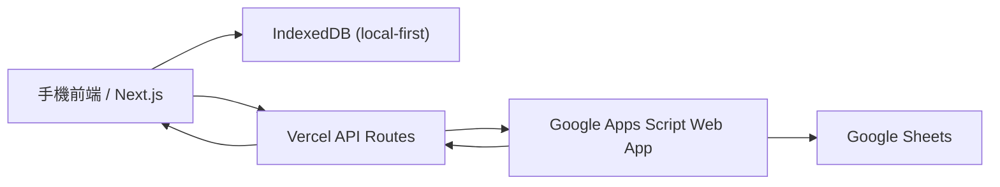

# 微high忠糧 2.0

園遊會手機收銀用的 local-first POS / 記帳系統。現場先寫入瀏覽器 IndexedDB，園遊會結束後再由使用者按鈕上傳到 Vercel API，Vercel 再轉送到 Google Apps Script，最後累加進 Google 試算表並把最新彙總結果抓回前端。

## 功能列表

- 手機優先收銀台：大按鈕、單手操作、底部六分頁導航。
- 單品與組合包同時支援，組合包會自動帶動內含商品數量。
- IndexedDB 本地持久化，離線時仍可繼續記帳。
- CSV 匯入商品、組合包、組合包成分，含欄位/型別/重複 ID 驗證。
- JSON 備份匯出/匯入，並提供 File System Access API 加分路徑。
- 單筆撤銷與清除當日資料，皆有確認流程。
- 同步狀態顯示：未同步、同步中、成功、失敗、已重製。
- Vercel API routes 與 GAS 腳本完整提供。
- GAS 端 batch idempotency，避免重送重複入帳。
- Google 試算表主檔、交易紀錄、Summary、SyncLog 結構完整。

## 技術架構

- Frontend: Next.js App Router + TypeScript + Tailwind CSS
- Local storage: IndexedDB
- Backend: Next.js Route Handlers on Vercel
- Sync target: Google Apps Script + Google Sheets
- Testing: Vitest



## 專案結構

- `src/app`: App Router 頁面、manifest、API routes
- `src/components`: App provider、頁面 shell、六個分頁元件
- `src/lib`: 型別、CSV 驗證、同步批次、銷售快照、IndexedDB、API client
- `gas`: Google Apps Script 程式與 `appsscript.json`
- `sample-data/csv`: 可直接用來初始化的範例 CSV
- `tests`: 純函式測試

## 本地開發

1. 安裝依賴：

```bash
npm install
```

2. 建立環境變數：

```bash
cp .env.example .env.local
```

3. 啟動開發環境：

```bash
npm run dev
```

4. 驗證：

```bash
npm run lint
npm run test
npm run build
```

## Vercel 部署

1. 將此專案 push 到 GitHub repo。
2. 在 Vercel 匯入該 repo。
3. 設定環境變數：
   - `GAS_WEBAPP_URL`
   - `NEXT_PUBLIC_APP_NAME`
4. Deploy。
5. 部署完成後，使用 `/api/health` 確認 Vercel 端已讀到 `GAS_WEBAPP_URL`。

## Google 試算表與 GAS 設定

1. 建立一份新的 Google 試算表。
2. 打開 Apps Script。
3. 將 `gas/Code.gs` 與 `gas/appsscript.json` 內容貼進去。
4. 儲存後執行一次任意函式，授權 Apps Script。
5. Deploy 為 Web App：
   - Execute as: `Me`
   - Who has access: `Anyone` 或 `Anyone with the link`
6. 複製 Web App URL，填入 Vercel 的 `GAS_WEBAPP_URL`。
7. 首次呼叫後，GAS 會自動建立以下工作表：
   - `Products`
   - `Bundles`
   - `BundleComponents`
   - `SalesLog`
   - `Summary`
   - `SyncLog`

## 試算表欄位說明

- `Products`: 商品主檔與價格/成本/淨利
- `Bundles`: 組合包主檔與售價/成本/淨利
- `BundleComponents`: 組合包與商品對照
- `SalesLog`: 每筆本地 sale snapshot 的 append-only 記錄
- `Summary`: 由 `SalesLog` 重建的總覽指標
- `SyncLog`: 批次處理紀錄與 idempotency 依據

## CSV 匯入格式

範例檔案位於：

- `sample-data/csv/products.csv`
- `sample-data/csv/bundles.csv`
- `sample-data/csv/bundle_components.csv`

### `products.csv`

欄位：

`product_id,name,price,cost,profit,category,is_active,sort_order`

### `bundles.csv`

欄位：

`bundle_id,bundle_name,bundle_price,is_active,sort_order`

### `bundle_components.csv`

欄位：

`bundle_id,product_id,quantity`

## 同步流程

1. 收銀操作先寫入 IndexedDB。
2. UI 即時用本地銷售快照重算今日營收/成本/淨利。
3. 按 `上傳營業額` 時：
   - 若已有失敗批次，先重送舊批次。
   - 沒有舊批次時，從 `pending` 銷售建立新 batch。
   - 每個 batch 都含 `batchId`、`deviceId`、`sessionId`、`checksum`、sales snapshot。
4. Vercel API 把 batch 轉送到 GAS。
5. GAS 以 `batchId` 查 `SyncLog`，若已處理則回 `alreadyProcessed`。
6. GAS 若尚未處理，將 sales append 到 `SalesLog`，重建 `Summary`，寫入 `SyncLog`。
7. Vercel API 把最新 snapshot 回傳前端。
8. 前端只有在成功時才移除該 batch 的本地銷售；全部批次清空後才重設 session。

## 歷史快照規則

- 每筆 sale 都儲存名稱、售價、成本、淨利快照。
- 組合包 sale 會儲存 component breakdown。
- 後續主檔改名、改價、改成本，不會回頭改寫歷史交易。

## API 路由

- `GET /api/health`
- `GET /api/sync/latest`
- `POST /api/sync/upload`
- `POST /api/config/import`
- `POST /api/config/sync`
- `GET /api/config/export`

## 常見排錯

- `同步失敗但本地資料還在`：這是預期行為；修好網路或 GAS 後重新按一次即可。
- `一直顯示離線`：確認手機瀏覽器沒有被省流量模式攔截。
- `CSV 匯入失敗`：先看 `商品設定` 分頁的列號、欄位與錯誤訊息。
- `GAS 已部署但 /api/health 顯示未設定`：檢查 Vercel env 是否真的有 `GAS_WEBAPP_URL`。
- `試算表數字和前端不同`：按 `重新抓取試算表`，若仍不同，確認最新 batch 是否出現在 `SyncLog`。
- `重複點上傳`：同一批次會由 `batchId` 擋重，GAS 只會處理一次。

## 假設與取捨

- 本案不使用外部資料庫；營運資料最終以 Google 試算表為準。
- 收銀現場通常是一台手機或少量裝置各自作業，每個瀏覽器 profile 視為一個 device。
- 單筆撤銷只保證針對尚未進入同步批次的最後一筆本地銷售。
- 若已有失敗 outbox 批次，系統會優先重送舊批次，以降低重複入帳風險。
- `Summary` 工作表只存總覽指標；商品與組合包明細由 `SalesLog` 動態重建。
- GAS 端未額外加密或登入保護，採最簡單可部署方案；若你需要更嚴格的保護，可再加 shared secret。
- File System Access API 僅作加分路徑，主流程仍依賴 IndexedDB + 下載 JSON。
- 商品設定修改不會影響舊交易；歷史以成交快照為準。
